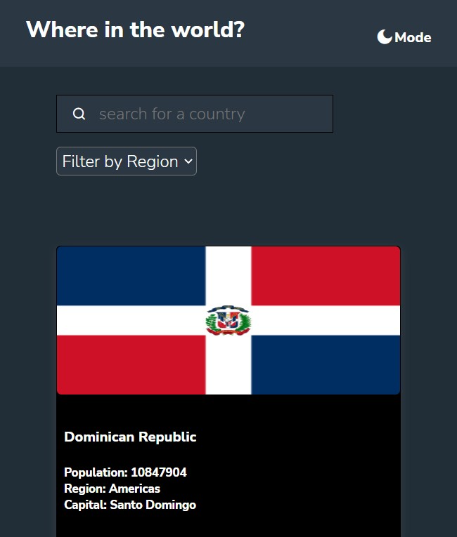
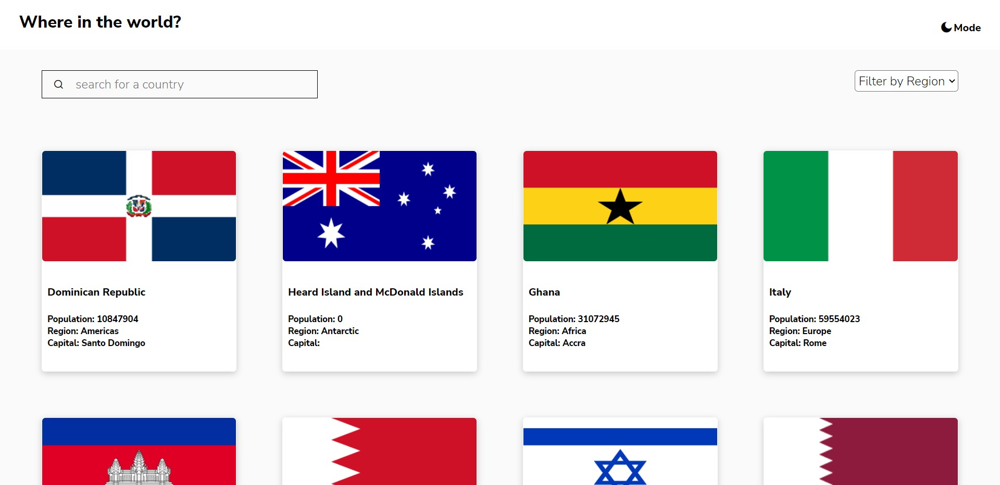
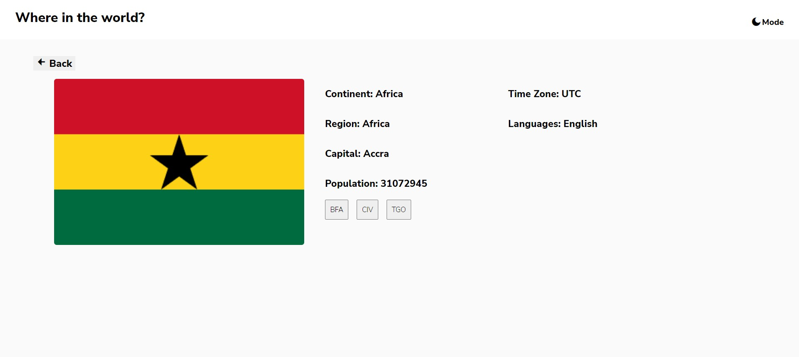
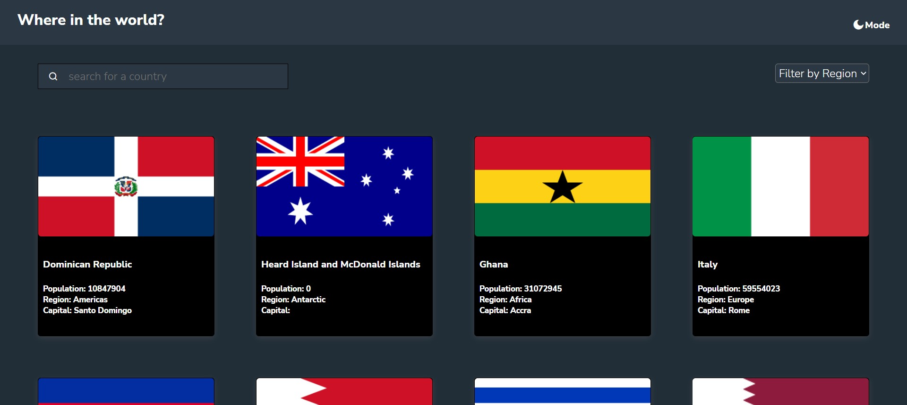
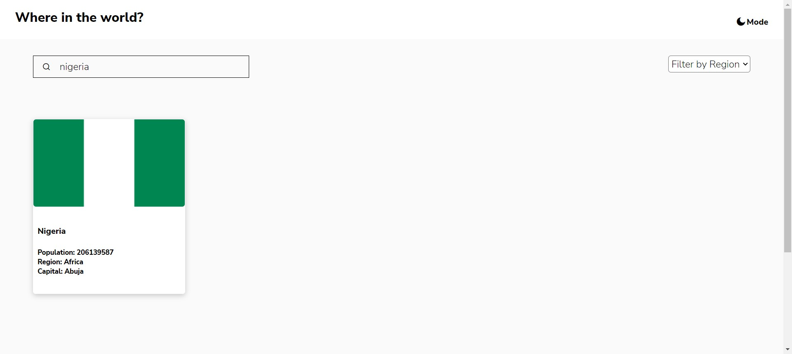

# Frontend Mentor - REST Countries API with color theme switcher solution

This is a solution to the [REST Countries API with color theme switcher challenge on Frontend Mentor](https://www.frontendmentor.io/challenges/rest-countries-api-with-color-theme-switcher-5cacc469fec04111f7b848ca). Frontend Mentor challenges help you improve your coding skills by building realistic projects. 

## Table of contents

- [Overview](#overview)
  - [The challenge](#the-challenge)
  - [Screenshot](#screenshot)
  - [Links](#links)
  - [Built with](#built-with)
  - [What I learned](#what-i-learned)
  - [Continued development](#continued-development)


## Overview

### The challenge

Users should be able to:

- See all countries from the API on the homepage
- Search for a country using an `input` field
- Filter countries by region
- Click on a country to see more detailed information on a separate page
- Click through to the border countries on the detail page
- Toggle the color scheme between light and dark mode *(optional)*

### Screenshot







### Links

- GitHub Repo: [Add solution URL here](https://github.com/smarist/country-finder.git)
- Live Site URL: [Add live site URL here](https://country-app-finder.netlify.app/
)

## My process

### Built with

- Semantic HTML5 markup
- CSS custom properties
- Flexbox
- CSS Grid
- Mobile-first workflow
- [React](https://reactjs.org/) - JS library
- React Router


### What I learned
1. I learnt how to use useParams, useContext, and custom hocks.
2. I learnt how to catch error in an API get call.


```

### Continued development

I would love to refactor the code for this project after i gain more knowledge.
I would love to learn how to use useCallBack hock.


- Twitter - [@mariskike](https://www.twitter.com/mariskike)


